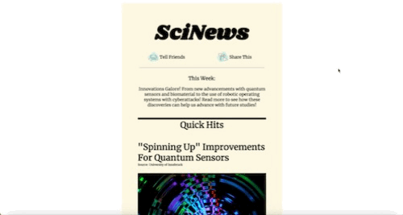

# sciNews

Seeking science updates? Check out this email template! This project allowed me explore the world of HTML Email templates and new techinques to utilize HTML & CSS. 
Creating email templates is different from creating a regular website and it was intersting to learn how to work within the constraints of HTML tables only. Also, it made me 
consider responsiveness with every section created because usually, I would work on it at the end of a project.

# What I Learned 
* Inline CSS is preferred over a seperate CSS/SCSS file
* 6-Digit hex codes need to be used since they are the only codes univesally supported 
* Stacking tables instead of using divs to create new sections

# Preview 

  

# Demo
🕹 [sciNews Email Template](https://bubblegumloco.github.io/sciNews/)

